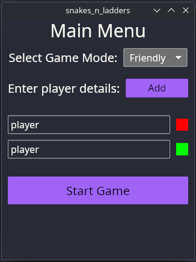
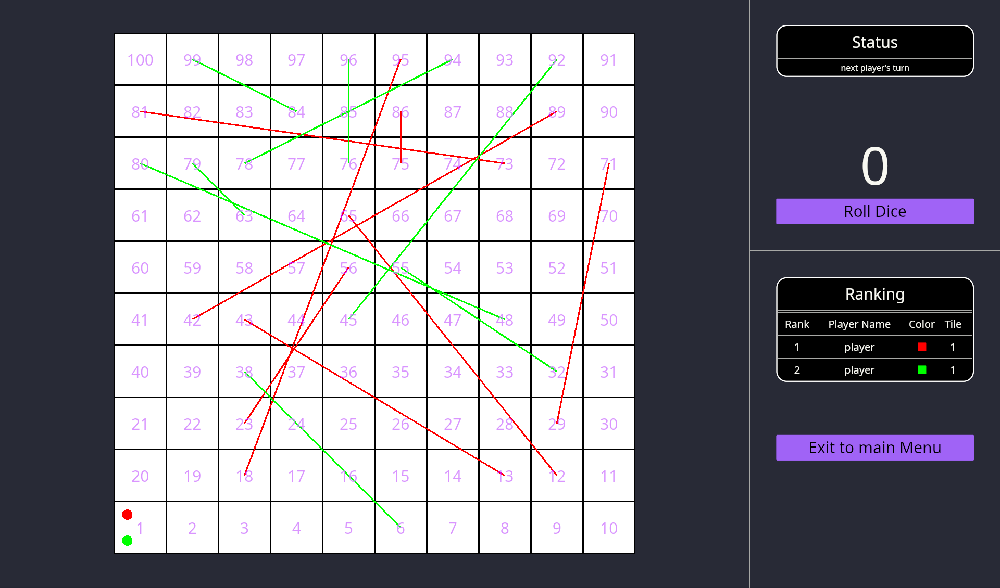

# Snakes And Ladders in Rust

## Description

A simple desktop **Snakes & Ladders** game built in **Rust** using **Iced**.  

Features:  
- Play with **2 to 4 players**  
- Three exciting modes: **Friendly**, **Bump**, and **Swap**  
- Intuitive **menu page** for easy player and mode selection  
- **Ranking Section** to show real time rank of players

Enjoy a classic board game experience with a modern Rust twist!

## how to install 

```
git clone https://github.com/atharva-nlt/snakes-n-ladders.git
cd ./snakes-n-ladders
cargo build --release
cargo run --release

```
## Images

* ### Menu Image

<div align="center">
  
</div>

* ### Game Image

<div align="center">
  
</div>
